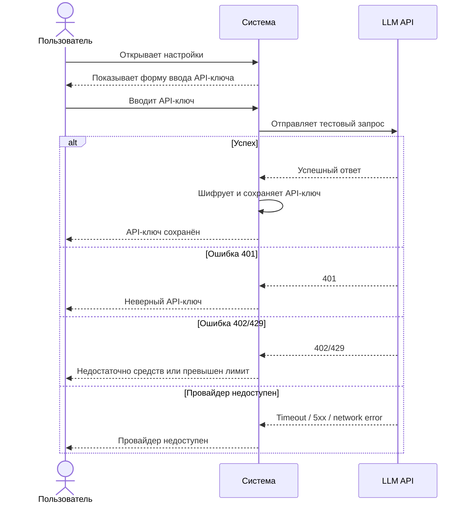
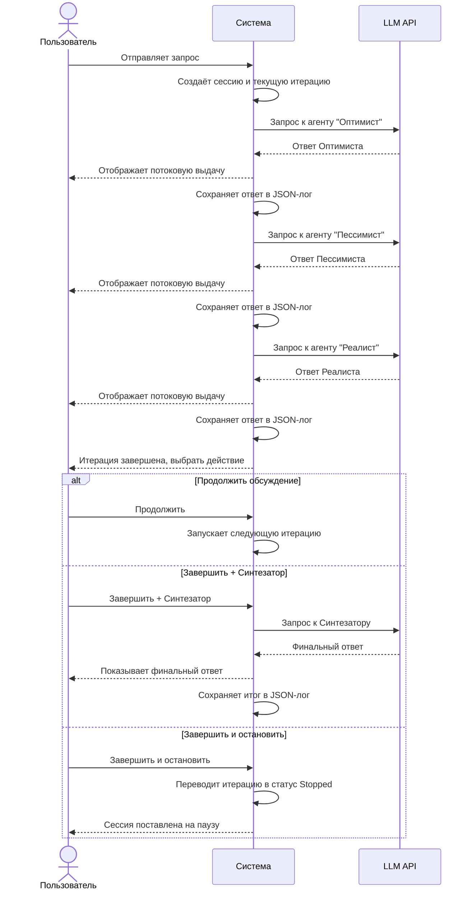

#### 1 Сценарий "Установка API"

``` mermaid
sequenceDiagram  
actor Пользователь  
participant Система  
participant LLM_API as LLM API  
  
Пользователь->>Система: Открывает настройки  
Система-->>Пользователь: Показывает форму ввода API-ключа  
Пользователь->>Система: Вводит API-ключ  
Система->>LLM_API: Отправляет тестовый запрос  
  
alt Успех  
LLM_API-->>Система: Успешный ответ  
Система->>Система: Шифрует и сохраняет API-ключ  
Система-->>Пользователь: API-ключ сохранён  
else Ошибка 401  
LLM_API-->>Система: 401  
Система-->>Пользователь: Неверный API-ключ  
else Ошибка 402/429  
LLM_API-->>Система: 402/429  
Система-->>Пользователь: Недостаточно средств или превышен лимит  
else Провайдер недоступен  
LLM_API-->>Система: Timeout / 5xx / network error  
Система-->>Пользователь: Провайдер недоступен  
end
```
#### 3 Сценарий "Дискуссия с LLM"

```mermaid
sequenceDiagram
actor Пользователь  
participant Система  
participant LLM_API as LLM API  
  
Пользователь->>Система: Отправляет запрос  
Система->>Система: Создаёт сессию и текущую итерацию  
  
Система->>LLM_API: Запрос к агенту "Оптимист"  
LLM_API-->>Система: Ответ Оптимиста  
Система-->>Пользователь: Отображает потоковую выдачу  
Система->>Система: Сохраняет ответ в JSON-лог  
  
Система->>LLM_API: Запрос к агенту "Пессимист"  
LLM_API-->>Система: Ответ Пессимиста  
Система-->>Пользователь: Отображает потоковую выдачу  
Система->>Система: Сохраняет ответ в JSON-лог  
  
Система->>LLM_API: Запрос к агенту "Реалист"  
LLM_API-->>Система: Ответ Реалиста  
Система-->>Пользователь: Отображает потоковую выдачу  
Система->>Система: Сохраняет ответ в JSON-лог  
  
Система-->>Пользователь: Итерация завершена, выбрать действие  
  
alt Продолжить обсуждение  
Пользователь->>Система: Продолжить  
Система->>Система: Запускает следующую итерацию  
else Завершить + Синтезатор  
Пользователь->>Система: Завершить + Синтезатор  
Система->>LLM_API: Запрос к Синтезатору  
LLM_API-->>Система: Финальный ответ  
Система-->>Пользователь: Показывает финальный ответ  
Система->>Система: Сохраняет итог в JSON-лог  
else Завершить и остановить  
Пользователь->>Система: Завершить и остановить  
Система->>Система: Переводит итерацию в статус Stopped  
Система-->>Пользователь: Сессия поставлена на паузу  
end
```